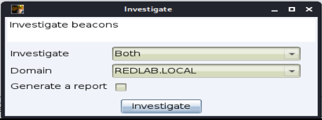
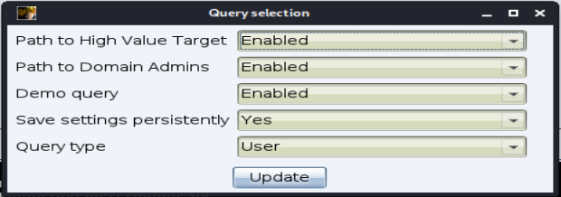
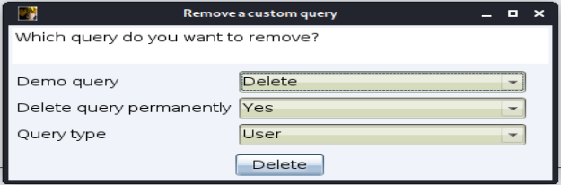

# pyCobaltHound

#TODO: Insert cool logo

## Quick summary

`pyCobaltHound` is an Aggressor script extension for Cobalt Strike which aims to provide a deep integration between `Cobalt Strike` and `Bloodhound`.

`pyCobaltHound` strives to assists red team operators by:

- Automatically querying the `BloodHound` database to discover escalation paths opened up by newly collected credentials.
- Automatically marking compromised users and computers as owned. 
- Allowing operators to quickly and easily investigate the escalation potential of beacon sessions and users.

To accomplish this, `pyCobaltHound` uses a set of build-in queries. Operators are also able to add/remove their own queries to fine tune `pyCobaltHound's` monitoring capabilities. This grants them the flexibility to adapt `pyCobaltHound` on the fly during engagements to account for engagement-specific targets (users, hosts etc..).

## Installation & usage

To install `pyCobaltHound` clone this repository. Do not forget to also clone the included submodule!

You can use the following command:

- `git clone https://github.com/A32AN/pyCobaltHound.git --recurse-submodules`

### Dependencies

Ensure that the following dependencies are correctly installed:

#### PyCobalt

`PyCobalt` is a Python API for `Cobalt Strike`. It exposes many Aggressor functions to be used directly from Python.

##### Setup

Ensure that you have `Python3+` installed. While `PyCobalt` probably works on macOS and Windows as well, I have only really tested it on Linux.

There are two ways to use the `PyCobalt` Python library:

1. Run it straight out of the repository using [PYTHONPATH](https://docs.python.org/3/using/cmdline.html#envvar-PYTHONPATH). `pyCobaltHound` takes this approach, setting the search path from within the Python program using the variable [`sys.path`](https://docs.python.org/3/library/sys.html#sys.path) variable.
2. Install the `PyCobalt` Python library. To do so, run `python3 setup.py install`. You will have to modify `pycobalthound.py` to ensure that it used the installed library instead of the one in  the included repository.

##### Remarks

- Note that there is no guarantee that the `PyCobalt` project will be maintained in the future. In fact,  the latest update to the project was to incorporate the changes made in `Cobalt Strike 4.2`. Since `pyCobaltHound` only really uses basic Aggressor functions to interface with `Cobalt Strike` and its operator however this is not a big problem for `pyCobaltHound`.
- I do not control the `PyCobalt` repository. 

##### Tips & tricks

- `PyCobalt` comes with some Script Console commands to manage the running Python scripts. When you reload your Aggressor script you should explicitly stop the Python scripts first. Otherwise they'll run forever doing nothing. During `pyCobaltHound's` development I noticed that this can also lead to undefined behavior.

  Reloading `pyCobaltHound` can be done as follows:

  ```
  aggressor> python-stop-all`
  [pycobalt] Asking script to stop: /root/pycobalthound/pycobalthound.py
  [pycobalt] Script process exited: /root/pycobalthound/pycobalthound.py
  
  aggressor> reload example.cna`
  [pycobalt] Executing script /root/pycobalthound/pycobalthound.py
  ```

- For `PyCobalt` to work properly you can only call `PyCobalt` in one Aggressor script. Keep this in mind if you want to use `pyCobaltHound` together with other Aggressor scripts that use `PyCobalt`. My approach is to have an Aggressor script with a calls to python() and include() for every `PyCobalt` based tool.

#### notify2 (Optional)

[`notify2`](https://notify2.readthedocs.io/en/latest/) is - or was - a package to display desktop notifications on Linux. As we will see later `pyCobaltHound` supports a few ways of notifying the operator.  `notify2` is used on Linux to send notifications  to the notification daemon over D-Bus.

To enable this, `notify2` needs to be installed using:

`pip install notify2`

### Usage in Cobalt Strike

Using `pyCobaltHound` in `Cobalt Strike` is as simple as importing the `pycobalthound.cna` Aggressor script into your client. Once this is done you should see a`pyCobaltHound` menu appear under `Cobalt Strike`


## Usage

### Credential store monitoring

`pyCobaltHound's` initial goal was to monitor `Cobalt Strike's` credential cache (`View` > `Credentials`) for new entries. It does this by reacting to the *on_credentials* event that `Cobalt Strike` fires when changed to the credential store are made.

When this event is fired, `pyCobaltHound` will:

1. Parse and validate the data recieved from `Cobalt Strike`
2. Check if it has already investigated these entities by reviewing it's cache
3. Add the entities to a cache for future runs
4. Check if the entities exist in the `BloodHound` database
5. Mark the entities as owned
6. Query the `BloodHound` database for each new entity using both build-in and custom queries.
7. Parse the returned results, notify the operator of any interesting findings and write them to a basic HTML report.

Since all of this takes place asynchronously from the main `Cobalt Strike` client this process should not block your UI so you can keep working while `pyCobaltHound` investigates away in the background.

`pyCobaltHound` uses seperate caches per teamserver to prevent issues when using multiple teamservers.

#### Removing entities from the cache

Sometimes there are situations where you would want to investigate specific users (or the entire credential store) again. This might be the case when you've uploaded new data into the `BloodHound` database. 

Since `pyCobaltHound` should have investigated (and therefore cached) all entities in your credential store already it will not evaluate them against this new data without some operator intervention.

Two methods are available to operators to control which entities are cached.

##### Removing specific entities

In cases where you wish to remove a specific entity (or multiple) from the cache you can do so in the credential viewer (`View` > `Credentials`). Simply select your target(s) and click the *remove from cache* option under the `pyCobaltHound` menu entry.

##### Removing the entire cache

In cases where you wish to remove all entities from the cache you can do so in `pyCobaltHound's` main menu (`Cobalt Strike` > `pyCobaltHound` > `Wipe cache`). This is most helpful when you want to reevaluate your entire credential store.


##### Manually triggering an investigation

After removing your targets from the cache you can manually prompt `pyCobaltHound`  to re-investigate the contents of the credential store. This follows exactly the same process as above.

### Beacon management

`pyCobaltHound` contains functionality to interact with existing beacon sessions. This can be found in the beacon context menu. Note that these commands can be executed on a single beacon or a selections of beacons.


This functionality is especially useful when dealing with users and computers whose credentials have not been compromised (yet), but that are effectively under our control (e.g because we have a beacon running under their session token).

#### Mark as owned

The *Mark as owned* functionality (`pyCobaltHound` > `Mark as owned`) can be used to mark a beacon (or collection of beacons) as owned in the `BloodHound` database.


This dialog will ask the operator for the following information:

- **Nodetype**
  - **Both:** If this is selected, both the user and computer associated with the beacon context will be marked as owned. `pyCobaltHound` will only mark computers as owned if the beacon session is running as local admin, SYSTEM or a high integrity session as another user.
  - **User:** If this is selected the user associated to the beacon context will be marked as owned.
  - **Computer:** If this is selected the computer associated to the beacon context will be marked as owned, regardless of the integrity level of  the associated session.
- **Domain**
  - Since a beacons context does not contain any reference to the domain, operators need to specify this themselves 

#### Investigation

The *Investigate* functionality (`pyCobaltHound` > `Mark as owned`) can be used to investigate the users and hosts associated with a beacon (or collection of beacons).



This dialog will ask the operator for the following information:

- **Nodetype**
  - **Both:** If this is selected, both the user and computer associated with the beacon context will be investigated. `pyCobaltHound` will only investigate computers if the beacon session is running as local admin, SYSTEM or a high integrity session as another user.
  - **Both without logic:** If this is selected, both the user and computer associated with the beacon context will be investigated. `pyCobaltHound` will investigate all entities without checking for integrity levels.
  - **User:** If this is selected the user associated to the beacon context will be marked as owned.
  - **Computer:** If this is selected the computer associated to the beacon context will be marked as owned, regardless of the integrity level of  the associated session.
- **Domain**
  - Since a beacons context does not contain any reference to the domain, operators need to specify this themselves
- **Generate a report**
  - If this option is selected a basic HTML report will be generated

### Entity investigation

`pyCobaltHound` contains functionality to freely investigate entities. This can be found in the main menu (`Cobalt Strike` > `pyCobaltHound` > `Investigate` ).

This functionality is especially useful when dealing with users and computers whose credentials have not been compromised and are not under our control. 


This dialog will ask the operator for the following information:

- **Targets**
  - A CSV-style string of entities the operator wishes to investigate. This can be just user/computer names (e.g user1) **or** FQDNs (user1@domain.local).
  - **Note:** Do not mix & match notations. You can do either user/computer names or FQDN's!
- **Domain included**
  - This parameter specifies if the provided target string contains just user/computer names or FQDNs.
- **Domain**
  - If the targetstring does not contain FQDNs the operator will need to indicate the domain the entities to investigate belong to.
- **Generate a report**
  - If this option is selected a basic HTML report will be generated

## Settings

`pyCobaltHound's` settings menu can be found under `Cobalt Strike` > `pyCobaltHound` > `Settings`. 


If the *save settings persistently* option is chose, `pyCobaltHound` will save your settings to disk. Everytime `pyCobaltHound` is reloaded, it will check for the existence of a settings file and load the saved settings if it finds one. 

Saving settings to disk is the default in most of `pyCobaltHound's` dialogs but the operator will always have the option not to. If you wish to change this default, you will need to edit the scripts. If there is enough demand, I may add a global preference to the settings menu.

`pyCobaltHound` saves a settings file per teamserver, so it is possible to have different settings on different teamservers. This has not been extensively tested yet so expect bugs!

#### Neo4j

To authenticate to the `BloodHound` database, `pyCobaltHound` will need the following information:

- **Neo4j username**
- **Neo4j password**
- **Neo4j URL**

**Note:** if you choose to persistently save your settings (to preserve them across client/host reboots) `pyCobaltHound` will deserialize and store these credentials on disk.

#### Caching

As discussed before, `pyCobaltHound` uses caching to make sure it does not perform unnecessary work. This caching can be disabled in the settings. This is mostly useful when developing new queries so you don't constantly have to manage/wipe the cache.

#### Notifications

 `pyCobaltHound` supports a few different methods of notifying the operator once it has identified an entity of interest. It is possible to disable these notifications.

##### Native notifications

By default, `pyCobaltHound` will notify the operator using the default Aggressor messagebox. I find this option rather annoying since these messageboxes tend to interrupt the operators workflow. It is however the default method since it it supported on each platform you can run a `Cobalt Strike` client.


##### Notify2 notifications

`pyCobaltHound` also supports displaying desktop notifications on Linux. I prefer this since it does not interrupt the operators workflow.


#### Reporting

During some of its workflows, `pyCobaltHound` will generate an HTML report. This design choice was made to avoid spamming the operator with giant notifications in case a lot of entities were investigated. These reports will be generated in the *reports* folder. It is possible to disable the report generation.


## Queries

### Build-in queries

`pyCobaltHound` currently supports the following build-in queries:

- **User** **(user-queries.json)**
  - Path to Domain Admins
  - Path to High Value Targets
- **Computer** **(computer-queries.json)**
  - Path to High Value Targets

### Managing queries

Managing the various queries that `pyCobaltHound` uses can be done through the main menu (`Cobalt Strike` > `pyCobaltHound` > `Queries`).


#### Enabling/Disabling queries

The *Update queries* dialog allows operators to enable/disable specific queries. When using the this dialog, the operator will first be asked what type of queries they want to update. This is done to dynamically render/load the correct queries during this workflow.


After answering the first dialog, the operator will then be presented with a list of all available queries of that type. Here they can choose which queries they wish to enable/disable.



The *Save settings persistently* option will cause `pyCobaltHound` to permanently edit the respective JSON file containing the queries. As of right now, a single JSON file per query type is used. This may cause confusion when using multiple teamservers. I will probably implement a solution for this soon.

The query type option is an ugly workaround to pass the query type to the next function in the workflow and is of no concern to the operator.

#### Adding custom queries

The *Add query* functionality allows operators to add/remove their own queries to fine tune `pyCobaltHound's` investigation capabilities. This grants them the flexibility to adapt `pyCobaltHound` on the fly during engagements to account for engagement-specific targets (users, hosts etc..).


This dialog will ask the operator for the following information:

- **Name**
  - The name of the custom query. This will be used in various menus & reports during `pyCobaltHounds` workflows.
- **Cypher query**
  - The Cypher query `pyCobaltHound` needs to execute. Operators are quite free to define their queries. The only requirements are the following:
    - `pyCobaltHound` dynamically generates the following Cypher string based on the entity names it is investigating:
      - `WITH [account names here] AS samAccountNames UNWIND samAccountNames AS names`.
      - The **{statement}** placeholder will be replaced with this string.
      - This Cypher string takes the samAccountNames of the targets and assigns them to the "names" variable.
      - To make your query work with this you must ensure that it starts with the following statement:
        - `MATCH (x) WHERE x.name STARTS WITH names`
        - I recommend filtering (e.g `(x:User)`) depending on which query type you are adding.
    - `pyCobaltHound` expects the query to return a distinct set of usernames.
      - To do so, end your query with `RETURN DISTINCT (x.name)`
    - For some examples, refer to the build-in queries.
- **Report headline**
  - The headline that `pyCobaltHound` uses for the custom query. This will be used in  notifications & reports during `pyCobaltHounds` workflows.
    - The only requirement is the the sentence contains a **{number}** placeholder which `pyCobaltHound` will replace with the amount of results for this query.
- **Status**
  - This parameter determines if the query is created in an enabled or disabled state.
- **Query type**
  - The type of query you are adding. This will determine which set of queries is edited.

The *Save settings persistently* option will cause `pyCobaltHound` to permanently edit the respective JSON containing the queries. As of right now, a single JSON file per query type is used. This may cause confusion when using multiple teamservers. I will probably implement a solution for this soon.

#### Deleting custom queries

The *Delete query* dialog allows operators to remove specific custom queries from `pyCobaltHound`. When using the this dialog, the operator will first be asked what type of query they want to remove. This is done to dynamically render/load the correct queries during this workflow.


After answering the first dialog, the operator will then be presented with a list of all available queries of that type. Here they can choose which queries they wish to remove.



The *Save settings persistently* option will cause `pyCobaltHound` to permanently edit the respective JSON file containing the queries. As of right now, a single JSON file per query type is used. This may cause confusion when using multiple teamservers. I will probably implement a solution for this soon.

The query type option is an ugly workaround to pass the query type to the next function in the workflow and is of no concern to the operator.

### Possible improvements

- [ ] Separate query JSON files per teamserver
- [ ] Code cleanup
- [ ] More build-in queries
- [ ] A clean function that removes each cache, settings and report file generated for a specific teamserver
- [ ] Allow operators to limit the amount of HTML reports generated
- [ ] Take a look at data/entities collected by AzureHound
- [ ] Pop-up notifications for Windows & macOS
- [ ] Make HTML reports a bit prettier
- [ ] ...

## References

#TODO